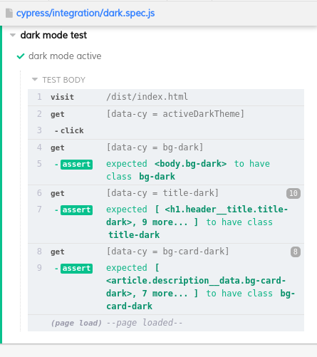

# [Social Media Dashboard](https://socialmediadash.netlify.app/)
## Sobre el proyecto
Es una página estática que muestra información sobre las redes del usuario @nathanf.

## Contruido con

- [Pug](https://pugjs.org/api/getting-started.html)
- CSS
- JavaScript 
- [Webpack](https://webpack.js.org/)

## Testing
Use Cypress para evaluar que el tema oscuro funcionara correctamente, evaluando si las reglas css
se aplicaban a los elementos.

## Uso 

Use `npm install` para instalar las dependencias del proyecto  
Para crear el build con webpack use `npm run build`  
Para abrir el test suite de cypreess use `npm run cypreess:open`
