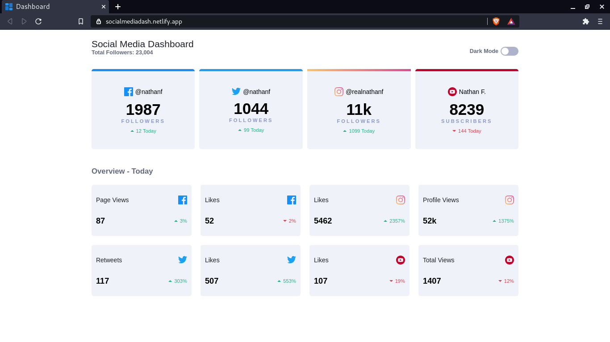
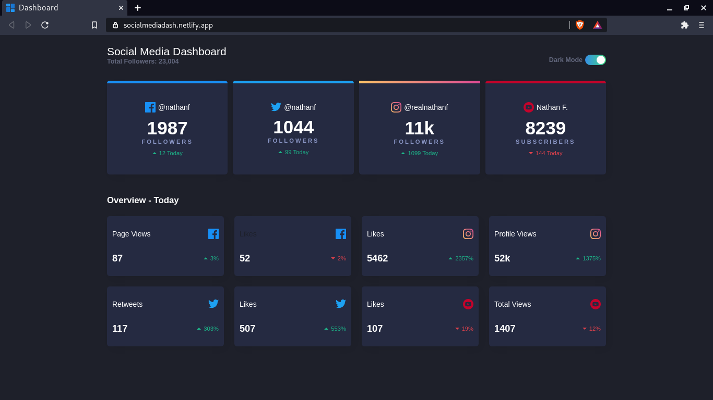

# [Social Media Dash](https://socialmediadash.netlify.app/)

 

## Descripcion
Es una pagina estatica que muestra ciertos datos de una
determianda red social. Para esto se uso las siguientes 
tecnologias:

Para el desarrollo:

- HTML
- CSS
- JavaScript 

Para el build del proyecto: 

- Babel
- Webpack

Para el testing de la pagina:

- Cypress

